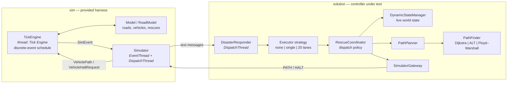

# RescueClean — Concurrent Disaster-Response Simulator

A discrete-event disaster-response simulation and an autonomous fleet controller that solves it.
The simulator floods a road network with rescue requests while roads collapse and buildings are
destroyed; the controller must route a fleet of 20 vehicles to evacuate as many people as possible
before the clock runs out.

The project exists to answer two engineering questions under a fixed simulation budget:

1. **How should message handling be parallelised** so that path computation never starves the
   simulation loop? — three interchangeable concurrency strategies.
2. **Which shortest-path algorithm wins** when the graph mutates constantly and the heap is
   capped? — three interchangeable routing strategies.

Both axes are swappable from a config file, with no recompilation, which makes the project a
controlled benchmark rather than a single fixed solution.

---

## Table of contents

- [At a glance](#at-a-glance)
- [Architecture](#architecture)
- [Repository layout](#repository-layout)
- [Getting started](#getting-started)
- [Configuration reference](#configuration-reference)
- [Message protocol](#message-protocol)
- [Solution design](#solution-design)
  - [Concurrency strategies](#concurrency-strategies)
  - [Path-finding strategies](#path-finding-strategies)
  - [Dispatch and re-routing policy](#dispatch-and-re-routing-policy)
  - [Vehicle state machine](#vehicle-state-machine)
- [Benchmarking](#benchmarking)
- [Design notes and trade-offs](#design-notes-and-trade-offs)
- [Known limitations](#known-limitations)
- [Project history](#project-history)
- [Credits](#credits)

---

## At a glance

| | |
|---|---|
| **Language** | Java (project language level **JDK 19**; source compiles under Java 8+) |
| **Runtime dependencies** | JDOM 2.0.6 (GraphML parsing) — everything else is the JDK |
| **Entry point** | [`sim.Simulator#main`](src/sim/Simulator.java#L29) |
| **Build system** | None — plain `javac`/`java`, or open the IntelliJ module |
| **Source size** | ~3,500 lines across 27 files |
| **Fleet size** | 20 vehicles ([`ConfigurationInfo.NUMBER_OF_VEHICLES`](src/util/ConfigurationInfo.java#L8)) |
| **Victims per rescue** | 50 ([`ConfigurationInfo.NUMBER_OF_VICTIMS_PER_RESCUE`](src/util/ConfigurationInfo.java#L9)) |
| **Maps** | 6 selectable road networks, 20 → 100,000 nodes, including a real Manhattan street graph |

Final output of a run (actual, shipped `cfg/sim.cfg`, ALT + 20 lanes, `MAP=3`):

```
****************************************************
* GRAND TOTAL OF PEOPLE SAVED IS 50 OUT OF 1000. *
* 0 VEHICLES LOST OUT OF 20.                       *
****************************************************
RESPONDER COMMS LOOP HAS TERMINATED
Benchmark retained heap MB=9
```

Scores vary substantially between identical runs — see [Benchmarking](#benchmarking) for why.

---

## Architecture

The system is split into a **simulator** (`sim`, the provided harness) and a **solution**
(`solution`, the controller under test). They never share objects — they communicate only through
two `BlockingQueue<Message>` instances carrying pipe-delimited text. That boundary is the whole
point: the controller is a black box that must cope with asynchronous, out-of-order world updates.



**Threads at runtime**

| Thread | Owner | Responsibility |
|---|---|---|
| `Tick Engine` | `TickEngine` | Free-running tick loop; fires scheduled events |
| `Simulator-EventThread` | `Simulator` | Translates `SimEvent` objects into wire messages |
| `Simulator-DispatchThread` | `Simulator` | Parses `PATH`/`HALT` replies back into events |
| `DisasterResponder-DispatchThread` | `DisasterResponder` | Blocking receive loop; must never block for long |
| Worker executor(s) | responder variant | 0, 1, or up to 20 threads — the variable under test |

Executor threads are created **lazily** — `Executors.newSingleThreadExecutor()` spawns its worker only
on the first submitted task. The sharded variant therefore reaches 22 threads only once every vehicle
has received at least one message, and the inline variant never starts its inherited executor at all.

The tick engine **free-runs**: each tick performs an xorshift step and increments the clock
([`TickEngine.advance`](src/sim/TickEngine.java#L82)). It does not wait for the controller. Every
tick the controller spends computing a route is a tick a vehicle spends parked — which is exactly
why both the concurrency model and the path-finder choice show up directly in the score.

---

## Repository layout

```
rescueClean/
├── cfg/sim.cfg                  # the single knob-board for a run
├── data/*.graphml               # road networks consumed by the *solution*
├── rm.0.obj … rm.5.obj          # serialised RoadModel consumed by the *simulator*
├── lib/                         # JDOM 2.0.6 (+ unused SLF4J and Xalan jars)
└── src/
    ├── sim/                     # PROVIDED harness — do not modify
    │   ├── Simulator.java       # entry point, queue wiring, reflection-based responder load
    │   ├── TickEngine.java      # discrete-event scheduler, world mutation
    │   ├── Model.java           # RoadModel, Vehicle, Rescue; damage generation
    │   ├── SimEvent.java        # every event type in the simulation
    │   ├── MessageProcessor.java# SimEvent ⇄ wire-format codec
    │   └── Message.java
    ├── solution/                # THE SOLUTION
    │   ├── DisasterResponder.java              # provided base class
    │   ├── MyDisasterResponderAbstract.java    # parsing + wiring (template)
    │   ├── MyDisasterResponderWithoutExecutors.java
    │   ├── MyDisasterResponderWithSingleExecutor.java
    │   ├── MyDisasterResponderWithMultipleExecutors.java
    │   ├── RescueCoordinator.java              # dispatch & re-route policy
    │   ├── DynamicStateManager.java            # live fleet / roads / pending rescues
    │   ├── VehicleState.java
    │   ├── PathPlanner.java                    # round-trip waypoint construction
    │   ├── PathFinder.java                     # strategy interface
    │   ├── PathFinderDijkstra.java
    │   ├── PathFinderAStarALT.java
    │   ├── PathFinderFloydWarshall.java
    │   ├── Graph.java / GraphNode.java / GraphEdge.java
    │   ├── GraphBuilder.java                   # GraphML → Graph
    │   └── SimulatorGateway.java               # outbound message facade
    └── util/
        ├── ConfigurationInfo.java              # config + map table
        └── Pair.java
```

> **`data/` vs `rm.*.obj`** — these are two views of the same world. The simulator deserialises its
> authoritative `RoadModel` from `rm.<MAP>.obj`; the controller independently parses the matching
> `data/*.graphml` to build its own routing graph. They are indexed by the same `MAP` value and must
> stay in sync. `data/` contains eight additional maps (10, 30, 40, 50, 200, 500, 1000, 25000 nodes)
> that are not reachable from the `MAP` setting because they have no corresponding `rm.*.obj`.

---

## Getting started

### Prerequisites

- A JDK. The IntelliJ module targets **JDK 19** (`azul-19`), but the source uses no syntax newer
  than Java 8, so any modern JDK works.
- **Windows.** Map paths are hard-coded with backslashes — see [Known limitations](#known-limitations)
  for the one-line change needed on Linux/macOS.

If `java`/`javac` are not on your `PATH` (common when JDKs are managed by IntelliJ, which installs
them under `~/.jdks`), put one there for the session first:

```powershell
$env:PATH = "$env:USERPROFILE\.jdks\azul-19.0.2\bin;$env:PATH"
javac -version    # expect: javac 19.0.2
```

### Build

All commands must run from the **repository root** — `cfg/sim.cfg`, `rm.<MAP>.obj` and `data/` are
all resolved relative to the working directory.

```powershell
# Windows (PowerShell) — javac needs an argfile here, since the shell won't expand a recursive glob
New-Item -ItemType Directory -Force out | Out-Null
Get-ChildItem -Recurse src -Filter *.java | ForEach-Object FullName | Set-Content sources.txt
javac -d out -cp "lib\jdom-2.0.6\jdom-2.0.6.jar" "@sources.txt"
Remove-Item sources.txt
```

```bash
# Linux / macOS (see Known limitations first)
mkdir -p out
javac -d out -cp lib/jdom-2.0.6/jdom-2.0.6.jar $(find src -name '*.java')
```

Only `jdom-2.0.6.jar` is required. The SLF4J and Xalan jars ship with the repo but no source file
imports them; JDOM's `SAXBuilder` uses the JDK's built-in JAXP parser.

### Run

```powershell
# Windows
java -cp "out;lib\jdom-2.0.6\jdom-2.0.6.jar" sim.Simulator
```

```bash
# Linux / macOS
java -cp out:lib/jdom-2.0.6/jdom-2.0.6.jar sim.Simulator
```

The run ends on its own: the tick engine prints the scoreboard, every thread terminates, and the JVM
exits without needing to be killed.

`MAP=3` (5,000 nodes, ALT) runs comfortably in the default heap — around 9 MB retained. Larger maps
and the Floyd–Warshall path-finder need an explicit cap; `MAP=4` needs several gigabytes just to
deserialise its 22 MB road model:

```powershell
java -Xmx2g -cp "out;lib\jdom-2.0.6\jdom-2.0.6.jar" sim.Simulator
```

> `out/` is listed in `.gitignore`, so a fresh clone contains no prebuilt classes — always compile
> first.

### Run from IntelliJ IDEA

Open the folder (the `.idea` module and `rescueClean.iml` are committed), mark `src` as the sources
root if prompted, and run `sim.Simulator`. Ensure the run configuration's working directory is the
project root.

---

## Configuration reference

Everything is driven by [`cfg/sim.cfg`](cfg/sim.cfg), a `java.util.Properties` file (`KEY=VALUE`).
No recompilation is needed to change any of it.

> **Comment syntax.** `Properties` honours only `#` and `!` as comment leaders. The shipped file uses
> `;`, so those lines are parsed as a property literally named `;` — harmless, since nothing reads
> that key, but use `#` for any comment you add.

| Key | Read by | Default in code | Meaning |
|---|---|---|---|
| `MAP` | simulator + solution | `2` / `1` ⚠️ | Map index 0–5 (see table below) |
| `RESPONDER_CLASS` | simulator | *none* | Fully-qualified controller class, loaded reflectively |
| `PATHFINDER` | solution | *none* | `DIJKSTRA` \| `ALT` \| `FLOYD` |
| `ALT_LANDMARKS` | solution | `16` | Landmark count for the ALT heuristic |
| `DURATION` | simulator | `200000` | Simulation length; ×1000 = ticks |
| `STARTUP_PERIOD` | simulator | `0` | Warm-up ticks (×1000) burned before the clock starts |
| `VEHICLE_SPEED` | simulator + solution | `1.0` / `0.2` ⚠️ | Distance units per tick |
| `NUM_RESCUES` | simulator | `20` | Rescue requests generated across the run |
| `ROAD_DAMAGE` | simulator | `0` | Probability each road starts blocked (0–1) |
| `LOCATION_DAMAGE` | simulator | `0` | Probability each node collapses during the run (0–1) |
| `RESCUE_DURATION` | simulator + solution | `1.0` ⚠️ | Deadline budget per rescue (×1000 ticks); `0` disables deadlines |
| `STDOUT_MESSAGES` | simulator | `false` | Echo every message crossing the boundary |
| `SEED` | simulator | `54678956` | Seeds the tick engine's xorshift state — **has no observable effect**, see below |

⚠️ Three keys have **inconsistent or unsafe defaults** — always set them explicitly. See
[Known limitations](#known-limitations).

### Map selection

`MAP` indexes parallel arrays in [`ConfigurationInfo`](src/util/ConfigurationInfo.java#L10-L25) and
also selects the simulator's serialised road model.

| `MAP` | Controller reads | Simulator reads | Base / depot node | Nodes | Edges |
|:---:|---|---|:---:|---:|---:|
| 0 | `data\map.20.graphml` | `rm.0.obj` | `1` | 20 | 66 |
| 1 | `data\map.100.graphml` | `rm.1.obj` | `1` | 100 | 340 |
| 2 | `data\map.2000.graphml` | `rm.2.obj` | `1` | 2,000 | 6,778 |
| 3 | `data\map.5000.graphml` | `rm.3.obj` | `1` | 5,000 | 17,162 |
| 4 | `data\map.100000.graphml` | `rm.4.obj` | `1` | 100,000 | 342,424 |
| 5 | `data\manhattan.graphml` | `rm.5.obj` | `42459137` | 4,426 | 9,626 |

`MAP=5` is a real street network (OpenStreetMap extract), which is why its base node id is an OSM
identifier rather than `1`. `MAP=4` needs several GB of heap just to deserialise `rm.4.obj` (22 MB
on disk, and every serialised edge carries an enclosing-instance reference).

GraphML schema is minimal — nodes carry only an `id`, edges carry a `d1` data key holding the road
length as a `double`. Edges are directed and listed in both directions for two-way roads.

---

## Message protocol

All traffic is pipe-delimited text. This is the complete surface.

### Simulator → controller

| Message | Meaning |
|---|---|
| `RESCUE\|LOCATION\|<node>\|PEOPLE\|<n>` | People need evacuating from `<node>` |
| `ROAD\|FROM\|<a>\|TO\|<b>\|STATUS\|CLEAR\|BLOCKED` | Road status change |
| `LOCATION\|<node>\|COLLAPSED` | Node destroyed; anything there is lost |
| `VEHICLE\|<n>\|ARRIVED\|LOCATION\|<node>` | Vehicle reached a waypoint |
| `VEHICLE\|<n>\|HALTED\|LOCATION\|<node>` | Vehicle stopped and awaits orders |
| `VEHICLE\|<n>\|RETURNED\|RESCUED\|<k>` | Vehicle reached base, `<k>` people banked |
| `VEHICLE\|<n>\|DESTROYED\|LOCATION\|<node>\|PEOPLE\|<k>` | Vehicle and cargo lost |
| `PEOPLE_TRANSFERRED\|LOCATION\|<node>\|VEHICLE\|<n>\|PEOPLE\|<k>` | Pickup completed |
| `WAYPOINT_INVALID\|VEHICLE\|<n>\|FROM\|<a>\|TO\|<b>\|ROAD\|BLOCKED\|NON_EXISTENT` | Next hop unusable |
| `PATH_INVALID\|VEHICLE\|<n>\|<reason>` | Path rejected: `INVALID_NUMBER`, `DESTROYED`, `STILL_MOVING`, `INVALID_STARTING_POINT`, `UNKNOWN` |
| `ERROR\|<text>` | Malformed request from the controller |
| `SHUTDOWN` | Sentinel; ends the controller's receive loop |

### Controller → simulator

| Message | Meaning |
|---|---|
| `PATH\|VEHICLE\|<n>\|WAYPOINTS\|<a>,<b>,<c>,…` | Drive this exact node sequence |
| `HALT\|VEHICLE\|<n>` | Stop at the next waypoint |

A `PATH` is only accepted when the vehicle is **halted, alive, and standing on the first waypoint** —
otherwise the simulator answers `PATH_INVALID`. Re-routing therefore requires a
*halt → wait for `VEHICLE|n|HALTED` → send new `PATH`* handshake, which the controller implements
with the `isAwaitingHalt` flag.

---

## Solution design

The controller is layered so that policy, state, and routing are independently replaceable.

```
DisasterResponder            (provided) blocking receive loop
      ↓ handle(Message)
MyDisasterResponder*         concurrency strategy — the ONLY thing the three variants change
      ↓ worker(String)
MyDisasterResponderAbstract  parse wire format → typed coordinator calls
      ↓
RescueCoordinator            dispatch policy, locking, re-route decisions
      ↓                ↘
PathPlanner                DynamicStateManager   live graph, fleet, pending rescues
      ↓
PathFinder                 routing strategy
```

`MyDisasterResponderAbstract` deliberately leaves `handle()` empty and does all real work in
`worker(String)`. Each subclass overrides only `handle()` to decide *which thread* runs `worker` —
so the three variants are 17, 20 and 98 lines, and differ in nothing but scheduling. (Despite its
name the class is not `abstract`; the empty `handle()` makes it directly instantiable, though it
would then silently ignore every message.)

### Concurrency strategies

Selected with `RESPONDER_CLASS`.

| Variant | Threads | How work is scheduled | Trade-off |
|---|:---:|---|---|
| [`MyDisasterResponderWithoutExecutors`](src/solution/MyDisasterResponderWithoutExecutors.java) | 0 extra | `worker()` runs inline on the receive loop | Simplest and fully ordered, but a single slow path computation stalls **all** message intake, and back-pressures the simulator's 100-slot outbound queue |
| [`MyDisasterResponderWithSingleExecutor`](src/solution/MyDisasterResponderWithSingleExecutor.java) | 1 | `executor.submit()` onto one worker thread | Receive loop is freed immediately, global ordering preserved; the single worker is still a throughput ceiling |
| [`MyDisasterResponderWithMultipleExecutors`](src/solution/MyDisasterResponderWithMultipleExecutors.java) | up to 20 + 1 | **Sharded by vehicle**: `threadExecutors[vehicleNo % 20]` | Vehicles are routed in parallel while *per-vehicle* event order is still guaranteed |

The sharded variant is the interesting one. Rather than a shared pool — which would let two events
for the same vehicle be processed out of order — it holds an array of 20 *single-thread* executors
and picks the lane by vehicle number. Because the fleet is also 20 vehicles, every vehicle gets a
dedicated, strictly-ordered lane. Messages with no vehicle (`RESCUE`, `ROAD`, `LOCATION`) fall back
to the inherited single executor.

The lane count is fixed at 20 rather than derived from `availableProcessors()` — a deliberate choice
so the degree of parallelism is the same on every machine and does not itself become a variable in
the comparison. The auto-sizing expression is retained, commented out, on the line above
([`MyDisasterResponderWithMultipleExecutors.java:21-22`](src/solution/MyDisasterResponderWithMultipleExecutors.java#L21-L22)).

### Path-finding strategies

Selected with `PATHFINDER`. All three implement the same two-method
[`PathFinder`](src/solution/PathFinder.java) interface, so the coordinator is oblivious.

| | [`DIJKSTRA`](src/solution/PathFinderDijkstra.java) | [`ALT`](src/solution/PathFinderAStarALT.java) | [`FLOYD`](src/solution/PathFinderFloydWarshall.java) |
|---|---|---|---|
| **Algorithm** | Textbook Dijkstra, binary-heap PQ | A\* with Landmarks + Triangle inequality | Floyd–Warshall all-pairs |
| **Preprocessing** | none | `2k` Dijkstra runs (forward + reverse) | `O(V³)` |
| **Per query** | `O((V+E) log V)` — full SSSP every call | `O((V+E) log V)` worst case, but goal-directed pruning makes it far cheaper in practice | `O(1)` lookup, `O(path)` reconstruction |
| **Memory** | `O(V)` transient | `O(k·V)` resident landmark tables | `O(V²)` — two full matrices |
| **On graph change** | always current (reads the live graph) | tables kept, remain admissible (see below) | full `O(V³)` rebuild, version-triggered |
| **Practical ceiling** | large maps, slow | large maps, fast | ~2,000 nodes; compute-bound well before it is memory-bound |

**Why ALT is the default.** A\* needs an admissible heuristic; road-network Euclidean distance isn't
available here because GraphML nodes carry no coordinates — only edge lengths. ALT synthesises one
instead: pick `k` landmarks, precompute exact distances to and from each, and lower-bound any pair
by the triangle inequality
`h(s,t) = maxₗ ( d(s,L) − d(t,L) , d(L,t) − d(L,s) )`
([`getCostEstimate`](src/solution/PathFinderAStarALT.java#L237)). Landmarks are chosen by
**farthest-point (max–min) selection** — start from the node farthest from an arbitrary seed, then
repeatedly add the node whose minimum distance to the already-chosen set is largest — which spreads
them to the periphery where the bounds are tightest.

A useful property falls out of the damage model: the world only ever *loses* roads and nodes, so
true distances can only increase. Landmark tables computed on the pristine graph therefore remain
valid lower bounds for the whole run, and never need recomputing — a heuristic that is admissible
by construction against a monotonically degrading graph.

**Why Floyd–Warshall is included.** It is the deliberate negative control. `MAX_FW_NODES` is set to
1,000,000 specifically so the implementation *will* attempt maps it cannot fit, making heap
exhaustion reproducible ([`PathFinderFloydWarshall.java:13-16`](src/solution/PathFinderFloydWarshall.java#L13-L16)).
The two matrices cost `8V² + 4V²` bytes:

| Nodes | `double[][]` | `int[][]` | Total |
|---:|---:|---:|---:|
| 2,000 | 32 MB | 16 MB | **48 MB** |
| 5,000 | 200 MB | 100 MB | **300 MB** |
| 25,000 | 5.0 GB | 2.5 GB | **7.5 GB** ✗ |
| 100,000 | 80 GB | 40 GB | **120 GB** ✗ |

Memory is only the second wall, though. Every blocked road bumps `Graph.version`, invalidating the
cache and forcing a fresh `O(V³)` rebuild on the very next query — 8 × 10⁹ inner-loop iterations at
2,000 nodes, 1.25 × 10¹¹ at 5,000. With `ROAD_DAMAGE=0.3` that happens constantly, and because both
public methods are `synchronized`, the rebuild also serialises the 20 executor lanes back down to
one. Floyd–Warshall loses on a mutating graph long before it runs out of heap.

### Dispatch and re-routing policy

[`RescueCoordinator`](src/solution/RescueCoordinator.java) implements a **greedy nearest-idle-vehicle**
assignment, re-evaluated on every event that could free a vehicle or add work.

For each pending rescue, in order:
1. Scan the fleet for the alive, idle vehicle with the smallest `shortestDistance` to the target.
2. Reject if the trip cannot finish inside the deadline —
   `distance / VEHICLE_SPEED ≤ RESCUE_DURATION×1000` (skipped when `RESCUE_DURATION` is 0).
3. Build a **round trip** in one shot: `current → rescue → base`
   ([`PathPlanner.buildRoundTripWaypoints`](src/solution/PathPlanner.java#L35)) and send it as a
   single `PATH`. Pickup and return then need no further coordination — one message instead of
   three, which matters because the vehicle would otherwise sit idle waiting for the controller to
   react to `PEOPLE_TRANSFERRED`.
4. Remove the rescue from the pending list.

Re-routing is triggered by `ROAD ... BLOCKED` on a planned path, `LOCATION ... COLLAPSED` on a
planned path or on the vehicle's own target, and `WAYPOINT_INVALID`. Because the simulator refuses a
`PATH` for a moving vehicle, the coordinator sends `HALT`, sets `isAwaitingHalt`, and re-plans only
once the `HALTED` confirmation arrives. If the target has become unreachable, the rescue is
**re-queued** for another vehicle and this one is sent home; if the vehicle was already carrying
people, its cargo is prioritised and it returns to base directly.

### Vehicle state machine

[`VehicleState`](src/solution/VehicleState.java) tracks four orthogonal flags rather than an enum,
because a vehicle can legitimately be e.g. transporting *and* awaiting a halt at the same time.

| Flag | Set when | Cleared when |
|---|---|---|
| `isIdle` | halted with no pending re-route; returned to base | dispatched on a new path |
| `isAlive` | initial | `VEHICLE_DESTROYED`, or `PATH_INVALID … DESTROYED` |
| `isTransporting` | `PEOPLE_TRANSFERRED` received | vehicle returns to base |
| `isAwaitingHalt` | a re-route `HALT` has been sent | the `HALTED` confirmation arrives, or on dispatch |

`isAwaitingHalt` is what makes re-routing idempotent: several simultaneous road-collapse events
touching the same planned path produce exactly one `HALT`.

**Concurrency invariants.** Each `VehicleState` is its own monitor — every read-modify-write is
inside `synchronized (vehicle)`. Fleet-wide selection is additionally serialised by a single
`ReentrantLock dispatchLock`, so two lanes can never assign the same rescue to two vehicles.
`DynamicStateManager` is fully `synchronized`; the routing `Graph` uses a `ConcurrentHashMap` of
nodes whose adjacency lists are `CopyOnWriteArrayList`, so path-finders can traverse safely while
roads are being removed.

---

## Benchmarking

The project is set up to compare the nine (3 responder variants × 3 path-finders) combinations.

> ### ⚠️ Runs are not reproducible
>
> Despite the `SEED` key, **no two runs of the same configuration produce the same scenario.** `SEED`
> only initialises the tick engine's xorshift accumulator, whose output is never read by any decision
> — it exists purely to make each tick cost a fixed amount of CPU. Every actual random choice (which
> roads are damaged, which buildings collapse, where rescues appear, when they start) constructs a
> fresh **unseeded** `new Random()` — at [`Model.java:111`](src/sim/Model.java#L111),
> [`:127`](src/sim/Model.java#L127), [`:177`](src/sim/Model.java#L177) and
> [`:276`](src/sim/Model.java#L276).
>
> Repeated runs of the shipped configuration, with nothing changed between them, scored anywhere
> from 50 to 200 out of 1000 — a 4× spread from scenario noise alone. **Always average across many
> runs, and never compare two strategies on a single run each.**

1. Fix `MAP`, `DURATION`, `NUM_RESCUES`, `ROAD_DAMAGE` and `LOCATION_DAMAGE`.
2. Vary `RESPONDER_CLASS` and `PATHFINDER` one at a time.
3. Cap the heap identically across arms: `java -Xmx2g …`.
4. Repeat each arm enough times to average out scenario noise.
5. Record the two figures every run prints:
   - `GRAND TOTAL OF PEOPLE SAVED IS x OUT OF y` and `n VEHICLES LOST` — effectiveness.
   - `Benchmark retained heap MB=` — resident footprint, measured after a double `System.gc()` in
     the overridden [`shutdown()`](src/solution/MyDisasterResponderAbstract.java#L252-L269).

Set `STDOUT_MESSAGES=true` to trace every message across the boundary when debugging a policy
decision; leave it `false` for timing runs, since console I/O dominates (the shipped config emits
~7,500 lines per run).

The default configuration (`MAP=3`, 5,000 nodes, 30% road damage, ALT + 20 lanes) is the intended
headline scenario. At that size Floyd–Warshall is defeated by *recomputation* rather than memory —
its matrices fit a 2 GB heap, but each rebuild is ~1.25 × 10¹¹ inner-loop iterations and every
blocked road forces another. Memory becomes the hard wall from `MAP` 4 upward.

---

## Design notes and trade-offs

- **Strategy pattern on both axes.** Concurrency and routing vary independently behind
  `handle(Message)` and `PathFinder`. Neither `RescueCoordinator` nor `PathPlanner` contains a
  single branch on which strategy is active; selection happens once, in
  [`createPathFinder`](src/solution/MyDisasterResponderAbstract.java#L55-L66).
- **Lane sharding over a shared pool.** A `newFixedThreadPool(20)` would have been simpler and
  wrong: two events for one vehicle could interleave, corrupting its state machine. Hashing the
  vehicle id onto a dedicated single-thread executor buys parallelism *and* per-entity ordering
  without a single extra lock.
- **Round trips computed up front.** Planning `current → rescue → base` as one path trades a slightly
  more expensive plan for the removal of an entire coordination round-trip at pickup time.
- **Fine-grained locking.** Per-vehicle monitors plus one global dispatch lock, rather than one
  coarse lock around the coordinator — the expensive part (path computation) happens outside the
  dispatch lock wherever the policy allows.
- **Fixed thread count over `availableProcessors()`.** Holding the degree of parallelism constant
  keeps the host's core count out of the comparison; the auto-sizing expression is retained,
  commented out, alongside the constant.
- **The graph is mutated, not rebuilt.** Blocked roads call `Graph.removeEdge`, collapsed buildings
  call `removeNode`; an `AtomicInteger` version counter lets the Floyd–Warshall cache detect
  staleness without any cross-component coupling.

---

## Known limitations

These are real, reproducible caveats — worth knowing before a run behaves unexpectedly.

1. **Windows-only paths.** [`ConfigurationInfo.mapFiles`](src/util/ConfigurationInfo.java#L10-L17)
   hard-codes `data\\map.20.graphml` with backslashes. On Linux/macOS the backslash is a legal
   filename character, so `SAXBuilder` fails with a file-not-found. Fix by switching the separators
   to `/` (which works on Windows too) or by using `File.separator`.
2. **Inconsistent config defaults across the boundary.** If `MAP` is absent the simulator loads
   `rm.2.obj` while the controller loads `map.100.graphml` — two different worlds. `VEHICLE_SPEED`
   likewise defaults to `1.0` in `Model` but `0.2` in `SimulatorStaticParameters`, silently skewing
   the deadline calculation. **Always set every key explicitly.**
3. **`RESCUE_DURATION` must be an integer and must be present.**
   [`Model`](src/sim/Model.java#L45) defaults it to the string `"1.0"` and then calls
   `Long.parseLong` on it, so a missing key throws `NumberFormatException` at startup.
4. **`PATHFINDER` and `RESPONDER_CLASS` have no defaults** — omitting either aborts the run with an
   NPE or `ClassNotFoundException`.
5. **The responder is loaded with the deprecated `Class.forName(...).newInstance()`**
   ([`Simulator.java:50`](src/sim/Simulator.java#L50)), so any controller must expose a public
   no-argument constructor.
6. **`Floyd–Warshall` path reconstruction is recursive**
   ([`appendPath`](src/solution/PathFinderFloydWarshall.java#L160)) and can overflow the stack on
   very long paths; the implementation is in any case impractical above ~2,000 nodes because of
   rebuild cost.
7. **`PathFinderDijkstra.shortestDistance` recomputes a full single-source search per call**, and
   the dispatch loop calls it once per idle vehicle per pending rescue — the dominant cost of the
   `DIJKSTRA` configuration.
8. **Queue-direction comments in `DisasterResponder` are inverted.** `inMessageQueue` is documented
   as "outgoing messages to Simulator" but is in fact the *inbound* queue the receive loop drains
   ([`DisasterResponder.java:14-15`](src/solution/DisasterResponder.java#L14-L15)). The behaviour is
   correct; only the comments mislead.
9. **ALT landmark selection can spin** if `ALT_LANDMARKS` exceeds the size of the reachable
   component. [`selectLandmarksAndPrecompute`](src/solution/PathFinderAStarALT.java#L313) loops
   `while (fromLandmark.size() < landmarkTarget)`, but candidates unreachable from the chosen set are
   skipped, so an already-selected landmark can win and be re-`put`, leaving the size unchanged.
   There is no visited-set guard or iteration cap. Not triggered by the shipped maps at 8 landmarks.
10. **The ALT heuristic's fast paths skip the finiteness check.** When the source or target *is* a
    landmark, [`getCostEstimate`](src/solution/PathFinderAStarALT.java#L246-L253) returns the stored
    table value directly, with none of the `Double.isFinite` guard the general loop applies. For an
    unreachable pair that returns `POSITIVE_INFINITY`, which then poisons the priority ordering.
11. **`Graph.addEdge` dereferences without a null check**
    ([`Graph.java:37`](src/solution/Graph.java#L37)) and `GraphBuilder` calls it for every `<edge>`
    without verifying the source node was declared, so a malformed GraphML file throws an NPE on the
    main thread inside `setup()`. The shipped maps are well-formed.
12. **Most road updates never arrive.** The tick engine schedules one `RoadUpdate` per *edge* but
    spaces them by `lifetime / nodeCount` ([`Model.java:139-141`](src/sim/Model.java#L139-L141)). At
    `MAP=3` that is one update every 40,000 ticks against 17,162 edges — the last would fire at tick
    686 million, against a lifetime of 200 million. Only about 5,000 of the road states are ever
    reported, so the controller's view of the network stays permanently incomplete.
13. **`rm.*.obj` cannot practically be regenerated.** `RoadModel.RoadModelEdge` is a *non-static*
    inner class ([`Model.java:192`](src/sim/Model.java#L192)), so every serialised edge drags a
    reference to its enclosing `RoadModel` — which is why `rm.4.obj` is 22 MB. `RoadModel.addEdge`
    also hard-codes `open=true`, ignoring its own parameter. Treat these files as opaque fixtures.
14. **No automated tests.** Verification is by end-to-end simulation runs and the printed score.

---

## Project history

| Date | Milestone |
|---|---|
| 2026-04-13 | Scaffold imported — `sim` harness, `DisasterResponder`, `Graph`, `GraphBuilder`, maps, libs |
| 2026-04-15 | First working controller: Dijkstra + greedy dispatch |
| 2026-05-22 | Vehicle state tracking; waypoint construction extracted |
| 2026-05-23 | Damage handling and mid-mission re-routing; deadline feasibility check; layer split into `PathPlanner`, `DynamicStateManager`, `SimulatorGateway`, `PathFinder` |
| 2026-05-24 | Three concurrency variants unified under `MyDisasterResponderAbstract`; ALT path-finder |
| 2026-05-25 | Floyd–Warshall path-finder |
| 2026-06-02 | Lane count fixed at 20 so the host's core count stays out of the comparison |
| 2026-06-05 | Halt-handling bug fix; heap instrumentation |

**The one harness fix.** [`17c00e0`](src/sim/TickEngine.java#L173-L177) is the only behavioural
change made to the provided `sim` package. `TickEngine.pendingHalts` recorded a halt request but
never removed the entry, so once a vehicle had been halted *once* it was re-halted at every
subsequent waypoint forever — permanently disabling it. The fix is a single
`pendingHalts.remove(path.getVehicleNo())`.

---

## Credits

- **Controller (`solution` package), design and implementation** — Tharindu Wickramasinghe (`wick0167`).
  `Graph` was rewritten from the supplied skeleton; `GraphBuilder` was extended from it.
- **Simulation harness (`sim` package), `Graph`/`GraphBuilder` skeletons, map data and libraries** —
  provided as course scaffold (`lewi0146`, `leib0006`). The `sim` package is unmodified except for
  the one-line `TickEngine` halt fix noted above.
- **ALT heuristic** — adapted from
  [JGraphT's `ALTAdmissibleHeuristic`](https://github.com/jgrapht/jgrapht/blob/master/jgrapht-core/src/main/java/org/jgrapht/alg/shortestpath/ALTAdmissibleHeuristic.java),
  as documented in the class Javadoc.
- **JDOM 2.0.6** — Apache-style licence, see [`lib/jdom-2.0.6/LICENSE.txt`](lib/jdom-2.0.6/LICENSE.txt).

Built for Flinders University CP3 (2026 S1) major assignment.
